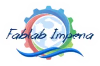

<!-- Questo file va in profile/README.it.md nel repo fablab-imperia/.github -->

[English](README.md) | **Italiano**

# Fablab Imperia APS

**Un laboratorio di fabbricazione digitale condiviso a Imperia — dove crei (quasi) qualsiasi cosa, insieme.**

[Sito](https://fablabimperia.org/) · [Wiki](https://wiki.fablabimperia.org/) · [Blog](https://fablabimperia.org/blog/) · [Eventi](https://fablabimperia.org/eventi/) · [YouTube](https://www.youtube.com/@fablabimperia4165/videos)

---

## Chi siamo

Fablab Imperia è un'associazione di promozione sociale (APS) e fa parte della rete globale dei fab lab — laboratori locali che rendono accessibile l'invenzione mettendo a disposizione strumenti per la fabbricazione digitale. Nel nostro laboratorio trovi stampanti 3D, una fresatrice CNC, un plotter da taglio, un banco di elettronica e attrezzi meccanici: tutto l'occorrente per trasformare un'idea in un prototipo.

Andiamo avanti grazie al **peer learning** — i soci realizzano progetti da soli e in gruppo, insegnandosi a vicenda lungo il percorso. *Se faccio, imparo.*

## Cosa trovi qui

Questa organizzazione ospita il codice sorgente, i progetti hardware e la documentazione dei nostri progetti. Tutto è aperto, così che chiunque possa usarlo, impararne e costruirci sopra.

**Progetto in evidenza — [MeshBee](https://github.com/fablab-imperia/meshbee)**
Nodi sensore alimentati a energia solare per le arnie, che trasmettono via MQTT a un server e a un'app mobile — un kit IoT per l'apicoltura. Si articola su più repository:
[firmware](https://github.com/fablab-imperia/meshbee-firmware) · [server](https://github.com/fablab-imperia/meshbee-server) · [app](https://github.com/fablab-imperia/meshbee-app) · [hardware](https://github.com/fablab-imperia/meshbee-hardware)

Sfoglia tutti i nostri repository qui sotto per scoprire a cosa altro stanno lavorando i nostri soci.

## Partecipa

Non serve essere esperti — sono benvenuti contributi di ogni dimensione, dalla correzione di un refuso alla progettazione di una scheda.

- Leggi la nostra [guida per contribuire](https://github.com/fablab-imperia/.github/blob/main/CONTRIBUTING.it.md) per iniziare.
- Cerca le issue etichettate **good first issue**.
- Chiediamo a tutti di rispettare il nostro [Codice di Condotta](https://github.com/fablab-imperia/.github/blob/main/CODE_OF_CONDUCT.it.md).
- Hai trovato un problema di sicurezza? Consulta la nostra [Politica di Sicurezza](https://github.com/fablab-imperia/.github/blob/main/SECURITY.it.md).

Preferisci creare di persona? Vieni a un [evento](https://fablabimperia.org/eventi/) o passa in laboratorio.

## Dove siamo

- **Email:** info@fablabimperia.org
- **Dove:** ARCI Il Campo delle Fragole — Viale Matteotti 31, 18100 Imperia (IM)
- **Quando:** sabato e domenica pomeriggio (telefona per conferma)

---

Associazione Fablab Imperia APS · C.F. 91043710085 · P.IVA 01665670087

Nello spirito della <a href="https://fabfoundation.org/global-community/#the-fab-charter">Fab Charter</a>: sicurezza · gestione · conoscenza

